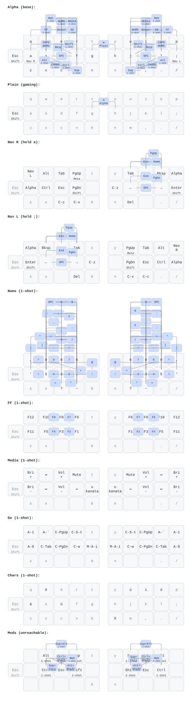

# kanata-config

A chord-based keyboard remapping config for [kanata](https://github.com/jtroo/kanata).

Typing, navigation, numbers/symbols, function keys, media, and app shortcuts are all entered
through **home-row chords** — combinations of adjacent keys pressed together — so your hands
rarely leave the home row. Built around a standard QWERTY 3×10 layout with `caps` repurposed
as escape/shift.

## Keymap diagram



[`keymap.svg`](keymap.svg) is rendered with
[keymap-drawer](https://keymap-drawer.streamlit.app/). All three files below belong to that
workflow — regenerate and commit the pair whenever chords or layers change:

| File | Role |
|---|---|
| `gen_keymap.py` | Encodes the layers/chords (mirrored by hand from the `.kbd` modules) and auto-solves non-overlapping combo placement |
| `keymap.json` | [keymap-drawer](https://keymap-drawer.streamlit.app/) input: layers + combos |
| `keymap.svg` | [keymap-drawer](https://keymap-drawer.streamlit.app/) output: the diagram above |

Regeneration:

1. **`gen_keymap.py` → `keymap.json`** — the script writes to `/tmp/keymap.json`; copy it
   over the repo copy when it looks right:

   ```sh
   python3 gen_keymap.py            # writes /tmp/keymap.json
   cp /tmp/keymap.json keymap.json
   ```

2. **`keymap.json` → `keymap.svg`** — paste the contents of `keymap.json` into the
   keymap-JSON tab of [keymap-drawer](https://keymap-drawer.streamlit.app/), then download
   the rendered SVG as `keymap.svg`.

**Source:** [spreadsheet](https://docs.google.com/spreadsheets/d/1zWwkYRQJQ8ao0kMYnWUnc-Qe-N1wYalShalTAtkvUZg/edit?usp=sharing)

## Layer system

| Layer | Purpose | How it's reached |
|---|---|---|
| `L_ALPHA` | Base typing layer; letters + modifiers + layer triggers via chords | default |
| `L_PLAIN` | Pass-through (no chords/modifiers) — for gaming | `g`+`h` chord |
| `L_CHARS` | Compose-key accents (á é í ó ú ñ ü) | one-shot chord |
| `L_NAV_R` / `L_NAV_L` | Navigation: arrows, home/end, pgup/pgdn, del/esc/tab | hold `;` / `a`, or one-shot |
| `L_NUMS` | Numbers and all symbols via chords | one-shot chord |
| `L_FF` | Function keys F1–F12 via chords | one-shot chord |
| `L_MEDIA` | Volume, brightness, playback; restart-kanata chord | one-shot chord |
| `L_GO` | Browser/app tab & window shortcuts | one-shot chord |

## File structure

`config.kbd` is the entry point — `defcfg`, `defsrc`, `defvar`, `defalias`, then six
`(include ...)` statements pulling in the modules below. **All files must stay co-located**:
kanata resolves includes relative to `config.kbd`.

| File | Contents |
|---|---|
| `config.kbd` | Entry point: config, source layout, vars, shared aliases, includes |
| `_alpha.kbd` | Base + chord layers (`L_ALPHA`, `L_PLAIN`, `L_CHARS`) |
| `_nav.kbd` | Navigation layers (`L_NAV_R`, `L_NAV_L`) |
| `_nums.kbd` | Numbers & symbols layer (`L_NUMS`) |
| `_ff.kbd` | Function-key layer (`L_FF`) |
| `_media.kbd` | Media layer (`L_MEDIA`) + `restart_kanata` alias |
| `_go.kbd` | App/browser shortcuts layer (`L_GO`) |

Each module's header documents its **needs** (vars/aliases it consumes) and **provides**
(layer/alias names it defines) — see `AGENTS.md` for the contract.

## Requirements

- [kanata](https://github.com/jtroo/kanata) (the remapper binary) — see upstream install docs.
- Linux: a systemd user service pointing at `~/.config/kanata/config.kbd` (the author's
  service definition lives in their [dotfiles](https://github.com/well1791/dotfiles)).

## Install

**Manual:**
```sh
git clone git@github.com:well1791/kanata-config.git ~/.config/kanata
kanata --cfg ~/.config/kanata/config.kbd --check   # validate
systemctl --user start kanata.service              # if you use the service
```

**Via chezmoi** (how the author wires it) — add to `.chezmoiexternal.toml`:
```toml
[".config/kanata"]
    type = "git-repo"
    url = "git@github.com:well1791/kanata-config.git"
    refreshPeriod = "168h"
```

## Uninstall

**Manual:**
```sh
systemctl --user disable --now kanata.service       # stop it, and stop it starting at login
rm -rf ~/.config/kanata
```

If you installed the service unit from the author's [dotfiles](https://github.com/well1791/dotfiles),
remove that unit file too (typically `~/.config/systemd/user/kanata.service`), then run
`systemctl --user daemon-reload`. To remove kanata itself as well, uninstall the binary with
your package manager (see upstream docs).

**Via chezmoi** — delete the `[".config/kanata"]` block from `.chezmoiexternal.toml`, then run
`chezmoi apply`. Delete `~/.config/kanata` yourself if the directory is left behind.

## Customizing

Layers are built from chord groups (`defchords CH_AL`, `CH_NA`, `CH_NS`, `CH_FF`) and
positional chord tokens (`ch_hrl` = home-row-left, etc.). See `AGENTS.md` for the naming
conventions and module contract before editing. Validate after every change:

```sh
kanata --cfg ~/.config/kanata/config.kbd --check
```

## See also

- [kanata](https://github.com/jtroo/kanata) — the remapper itself and its documentation.
- [well1791/dotfiles](https://github.com/well1791/dotfiles) — full machine config this is wired into.

## License

MIT — see [LICENSE](LICENSE). The [kanata](https://github.com/jtroo/kanata) remapper has
its own separate license.
